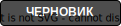
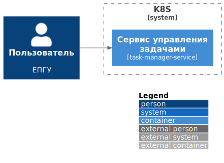
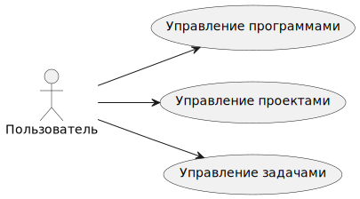
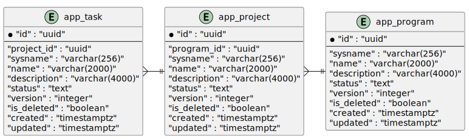

= Пример архитектурного документа
:revnumber: 1.0.0
:author: Денис Волненко
:email: denis.volnenko@rtlabs.ru
:encoding: utf-8
:lang: ru
:toc-title: Содержание
:toc: macro

[WARNING]
====
Документ создан автоматически.
Просьба не вносить изменения в Confluence!
====

[cols="25,75"]
|===

|*Статус документа*
a|

|*Ответственные*
a|
_Архитектор_ @denis.volnenko

|*Ревью архитектора*
|

|*Протокол встречи АК*
a|

|===

{nbsp} +

toc::[]

== Голосарий

[cols="1,20,80"]
|===

^|*№*
|*Название*
|*Описание*

^|01.
|ВС
|Вид сведений

^|02.
|СМЭВ
|Система межведомственного электронного взаимодействия.

^|03.
|СНИЛС
|Страховой номер индивидуального лицевого счёта.

^|04.
|ФЛ
|Физическое лицо.

|===

== 1. Архитектурные представления

=== 1.1. Цель разработки решения

----
TBD
----

=== 1.2. Представление контекста (Context View)

== 2. Представление вариантов использования (Use-case View)

== 3. Логическое представление (Logical View)

=== 3.1. Верхнеуровневая диаграмма компонентов

=== 3.2. Архитектурно значимые компоненты

[cols="0,20,80"]
|===

^|*№*
|*Название*
|*Описание*

|===

== 4. Представление процессов (Process View)

----
TBD
----

== 5. Представление нефункциональных требований (Non-functional View)

=== 5.1 Требования к производительности

----
TBD
----

=== 5.2. Требования к хранению данных

----
TBD
----

== 6. Физическая модель (Physical View)

=== 6.1. Требования к развёртыванию

----
TBD
----

=== 6.2. Требования по вычислительным мощностям

[cols="1,10,10,10,10,10,10,10,10"]
|===

^|*№*
|*Наименование*
^|*ЦОД*
|*OS*
^|*CPU*
^|*RAM*
^|*REPLICA*
^|*CPU ВСЕГО*
^|*RAM ВСЕГО*

^|01.
|task-manager-service
^|
|ALT
^|2
^|8гб
^|2
^|4
^|16гб

^|02.
|task-manager-service
^|
|ALT
^|2
^|8гб
^|2
^|4
^|16гб

^|03.
|task-manager-service
^|
|ALT
^|0.5
^|2гб
^|1
^|0.5
^|2гб

|===

== 7. Представление информационной безопасности (Security View)

=== 7.1. Регистрация событий безопасности

=== 7.2. Ролевая модель

== 8. Операционное представление (Operational View)

[cols="1,20,80"]
|===

^|*№*
|*Название*
|*Описание*

^|01.
|Git backend
a|

^|02.
|Git archdoc
a|

^|03.
|OpenAPI
a|

^|04.
|Graphana
a|

^|05.
|Elastic
a|

^|06.
|Sentry
a|

|===

== 9. Представление данных

=== 9.1. Логическая ERD-диаграмма

image::include/database/erd_logic.svg[]

=== 9.2. Физическая ERD-диаграмма

include::include/database/database.adoc[]

include::include/openapi/openapi.adoc[]